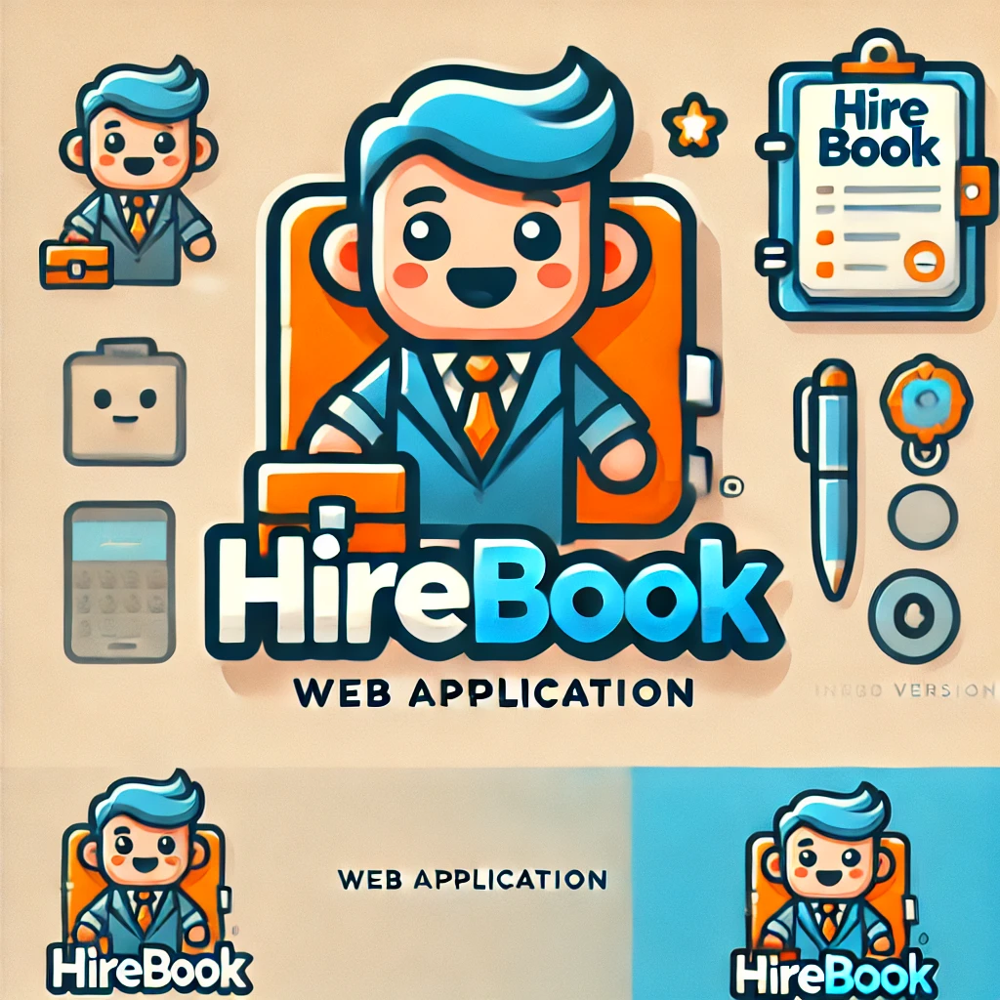

# 💻 HiReBOOK – Smart Hiring & Productivity Toolkit

<p align="center">
  
</p>

## 📘 Introduction

**HiReBOOK** is a modern, web-based productivity tool crafted for **Human Resources professionals** and small recruitment teams. It brings together **categorized note-taking**, **applicant tracking**, and **task management** into a single, seamless interface.

The platform empowers users to document candidate interactions, manage to-do lists, and stay organized throughout the hiring process — all in one place. With its clean and responsive design, HiReBOOK enhances focus, reduces clutter, and supports efficient, structured workflows.

Created as a personal project within the Powercoders program, HiReBOOK reflects both technical skill and a deep understanding of real-world HR needs. It serves as a portfolio centerpiece and a practical digital assistant for modern hiring.

---

## 🚀 Features

### ✏️ Notes & Content Management

- Categorized notes  
- Edit / delete notes  
- Filter and search functionality  
- Timestamps for creation and updates

### 👤 Candidate Tracking (Mini ATS)

- Add candidates with position and current status (Pending, Interviewed, Rejected)
- Candidate notes and custom tags
- Dynamic filtering by status or name

### ✅ Task & Reminder Management

- Create daily or weekly to-do lists
- Mark tasks as done with checkboxes
- Add deadline tags or categories

### ☁️ Cloud Synchronization

- Realtime data sync with **Firebase**
- Auto-save on every change
- Persistent data across devices and sessions

### 🎨 UI/UX

- Clean, minimal, and responsive design
- Light and dark mode support
- Built with modern component architecture

---

## 🛠️ Built With

- ⚛️ **React** – Component-based frontend library  
- 🧪 **Vite** – Lightweight and blazing-fast development setup  
- 💨 **Tailwind CSS** – Utility-first CSS framework  
- 🔥 **Firebase** – Cloud database and realtime data sync  
- 🌐 **Netlify** – Hosting and deployment  
- 🧑‍💻 **GitHub** – Version control and collaboration

---

## 📂 Sample Project Structure

```bash
hirebook/
├── public/
│   └── index.html                          # Root HTML file
├── src/
│   ├── assets/                             # Images, icons, logos
│   ├── components/                         # Reusable UI components
│   │   ├── Navbar.jsx
│   │   ├── Sidebar.jsx
│   │   ├── NoteCard.jsx
│   │   ├── CandidateCard.jsx
│   │   ├── TaskItem.jsx
│   │   └── ThemeToggle.jsx
│   ├── .
.
.
.

contexts/                                 
├── tailwind.config.js                      # Tailwind configuration
├── vite.config.js                          # Vite build configuration
└── README.md                               # Project documentation

```

## 📅 Timeline

| Week | Dates              | Milestone                                 |
|------|--------------------|--------------------------------------------|
| 1    | Apr 1 – Apr 6      | Project setup, UI layout, notes module     |
| 2    | Apr 7 – Apr 13     | Candidate tracking module, routing         |
| 3    | Apr 14 – Apr 20    | Task management module                     |
| 4    | Apr 21 – Apr 27    | Finalize UI, responsive adjustments        |
| 5    | Apr 28 – May 4     | Firebase integration, auto-sync setup      |
| 6    | May 5 – May 11     | Testing, final polish, documentation       |

🗓️ **Final delivery date:** **May 11, 2025**

## 💡 Purpose

HiReBOOK was built as a **Powercoders personal project**, aiming to showcase practical web development skills and solve real-world HR needs.

The goal is to create a fully functional, modern, and scalable web application that demonstrates proficiency in:

- Frontend development (React + Tailwind)
- Cloud integration (Firebase)
- UI/UX best practices
- Modular and component-based architecture

It is ideal for use in portfolio presentations and job interviews.

## 📸 Screenshots

> *Coming soon...*  
Screenshots and interface previews will be added after the UI is finalized.

## 🌐 Live Demo

🔗 *Coming soon...*  
The app will be deployed and available live on **Netlify** in the final week of development.

## 📖 License

[](https://opensource.org/licenses/MIT)

This project is licensed under the **MIT License**.  
See the [LICENSE](./LICENSE) file for more details.

---

<p align="center">
  
</p>

<p align="center">
  <strong>Yunus YILDIZ</strong><br>
  <a href="https://github.com/yunusyildiz-ch">
    
  </a>
  <a href="https://www.linkedin.com/in/yunusyildiz-ch">
    
  </a>
  <a href="https://bsky.app/profile/yunusyildiz.ch">
    
  </a>
  <a href="https://yunusyildiz.ch">
    
  </a>
</p>
